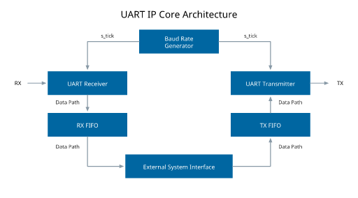

# Design Specification
# UART Core (Universal Asynchronous Receiver Transmitter)

## 1. Purpose

The purpose of this project is to design and implement a UART (Universal Asynchronous Receiver Transmitter) core using Verilog HDL or SystemVerilog targeting FPGA devices.

The UART core shall provide full-duplex asynchronous serial communication through transmit (TX) and receive (RX) interfaces.

The implementation shall be fully synthesizable and operate using a single system clock.

---

# 2. Scope

The design shall include the following functional blocks:

- Baud Rate Generator
- UART Receiver
- UART Transmitter
- Receive FIFO (RX FIFO)
- Transmit FIFO (TX FIFO)
- System Interface Logic

The following features are outside the scope of this project:

- RS-232 electrical conversion
- Software-programmable configuration registers
- Parity generation and checking
- RTS/CTS flow control
- Framing error detection
- Break detection

---

# 3. Reference Architecture

## 3.1 Reference Block Diagram

Figure 1 shows the expected functional decomposition of the UART subsystem.



---

## 3.2 Architecture Overview

The UART subsystem shall be composed of the following functional blocks:

### Baud Rate Generator

Generates the enable tick signal (`s_tick`) used by both the UART receiver and UART transmitter.

The generated tick shall operate at:

```text
16 × BAUD_RATE
```

and shall be used as an enable signal rather than as a separate clock.

---

### UART Receiver

Receives serial data from the RX input and reconstructs parallel data bytes using a 16× oversampling mechanism.

The receiver shall:

- Detect the start bit.
- Recover serial data bits.
- Verify the stop-bit interval.
- Generate a reception-complete indication.

---

### RX FIFO

Provides temporary storage for received data.

The RX FIFO decouples the UART reception rate from the processing rate of the external system and reduces the possibility of data overrun.

---

### UART Transmitter

Converts parallel data bytes into UART serial frames and transmits them on the TX output.

The transmitter shall:

- Generate start bits.
- Transmit data bits.
- Generate stop bits.
- Signal transmission completion.

---

### TX FIFO

Provides temporary storage for data waiting to be transmitted.

The TX FIFO decouples the UART transmission rate from the data production rate of the external system.

---

### External System Interface

Represents the interface between the UART subsystem and the system using the UART core.

The external system shall:

- Read data from the RX FIFO.
- Write data into the TX FIFO.
- Monitor FIFO status signals.

---

## 3.3 Reference Connectivity

The expected functional signal flow is:

```text
RX → UART Receiver → RX FIFO → External System Interface

External System Interface → TX FIFO → UART Transmitter → TX
```

The Baud Rate Generator provides timing information to both serial communication subsystems:

```text
Baud Rate Generator → s_tick → UART Receiver

Baud Rate Generator → s_tick → UART Transmitter
```

---

> Note:
>
> The architecture shown in Figure 1 represents the expected functional decomposition of the UART subsystem.
>
> Internal implementation details, including finite-state machines, ASMD descriptions, datapath organization, counters, shift registers, synchronization structures, and module partitioning remain the responsibility of the designer.
>
> Designers are free to choose the internal implementation provided that all requirements defined in this specification are satisfied.

---

# 4. Communication Parameters

## Architectural Requirement

The UART architecture shall be parameterizable in order to support different clock frequencies and baud rates.

At minimum, the design shall provide parameters equivalent to:

```systemverilog
parameter CLK_FREQ;
parameter BAUD_RATE;
```

where:

```text
CLK_FREQ  = System clock frequency
BAUD_RATE = Desired communication speed
```

Dynamic reconfiguration during runtime is not required. Reconfiguration may be performed at synthesis or elaboration time.

---

## Reference Configuration

The following configuration shall be used for development, simulation, verification, and project evaluation:

| Parameter | Value |
|------------|---------|
| Clock Frequency | 100 MHz |
| Baud Rate | 19,200 bps |
| Data Bits | 8 |
| Parity | None |
| Stop Bits | 1 |
| Bit Order | LSB First |
| Mode | Full Duplex |
| Oversampling | 16x |

All mandatory verification scenarios shall be executed using this configuration.

---

## Frame Format

```text
Idle  Start   D0 D1 D2 D3 D4 D5 D6 D7   Stop
 1      0      <------ Data ------>      1
```

Where:

```text
D0 = LSB
D7 = MSB
```

---

# 5. System Clock

## Architectural Requirement

The design shall operate using a single system clock.

The following are not allowed:

- Derived clock generation
- Clock gating
- Additional clock domains

All logic shall be synchronous to the system clock.

---

## Reference Clock

The target platform provides a reference clock of:

```text
100 MHz
```

All verification and acceptance tests shall use this frequency.

---

# 6. Baud Rate Generator

## Function

The baud-rate generator shall generate a periodic enable signal named:

```text
s_tick
```

used by the UART oversampling mechanism.

---

## Tick Frequency

The frequency of the generated signal shall be:

```text
s_tick = 16 × BAUD_RATE
```

For the reference configuration:

```text
BAUD_RATE = 19,200 bps

s_tick = 307,200 Hz
```

---

## Parameterization Requirement

The divisor used to generate `s_tick` shall be derived from the design parameters.

The implementation shall use a relationship equivalent to:

```text
DIVISOR = (CLK_FREQ / (16 × BAUD_RATE)) - 1
```

For the reference configuration:

```text
CLK_FREQ = 100 MHz
BAUD_RATE = 19,200 bps

DIVISOR ≈ 325
```

Hard-coded divisors tied to a specific clock frequency or baud rate shall not be used.

---

## Requirements

- `s_tick` shall remain asserted for exactly one clock cycle.
- `s_tick` shall be used as an enable pulse and not as a generated clock.

---

## Interface

### Inputs

```text
clk
reset
```

### Outputs

```text
s_tick
```

---

# 7. UART Receiver

## Function

The UART receiver shall:

- Detect the beginning of a frame.
- Recover serial data using 16x oversampling.
- Reconstruct the received byte.
- Indicate successful frame reception.

---

## Input Synchronization

The RX signal is asynchronous with respect to the system clock.

A two flip-flop synchronizer shall be implemented before the RX signal is used internally.

---

## Reception Algorithm

### Start Bit Detection

The receiver shall wait until:

```text
rx = 0
```

and then determine the center of the start bit using the oversampling scheme.

---

### Data Reception

The receiver shall:

- Sample each data bit at its estimated midpoint.
- Recover eight data bits.
- Reconstruct an 8-bit data word.
- Treat the first received bit as the LSB.

---

### Stop Bit Reception

After receiving the eight data bits:

- The receiver shall verify the stop bit interval.

---

## Reception Complete Indicator

After a valid frame is received:

```text
rx_done_tick
```

shall be asserted for one clock cycle.

---

## Data Output

```text
dout[7:0]
```

shall contain the received byte.

---

# 8. UART Transmitter

## Function

The UART transmitter shall convert an 8-bit parallel word into a serial UART frame and transmit it through the TX line.

---

## Transmission Start

Transmission shall begin when:

```text
tx_start
```

is asserted for one clock cycle.

---

## Transmission Sequence

### Idle State

```text
tx = 1
```

---

### Start Bit

```text
tx = 0
```

for one bit period.

---

### Data Bits

Transmit eight bits:

```text
D0 → D7
```

where:

```text
D0 = LSB
```

Each data bit shall remain valid for one full bit interval.

---

### Stop Bit

```text
tx = 1
```

for one bit interval.

---

## Completion Indicator

Upon completion of a transmission:

```text
tx_done_tick
```

shall be asserted for one clock cycle.

---

# 9. Receive FIFO

## Characteristics

- Data width: 8 bits
- Depth: 16 entries

---

## Write Operation

The FIFO shall automatically store received data whenever:

```text
rx_done_tick = 1
```

---

## Read Operation

Read operations shall be controlled by the external system.

---

## Status Signals

```text
rx_empty
rx_full
```

---

# 10. Transmit FIFO

## Characteristics

- Data width: 8 bits
- Depth: 16 entries

---

## Write Operation

Write operations shall be controlled by the external system.

---

## Read Operation

Data shall be automatically fetched by the transmitter whenever a new transmission is required.

---

## Status Signals

```text
tx_empty
tx_full
```

---

# 11. Top-Level Interface

## Clock and Reset

```systemverilog
input  logic clk;
input  logic reset;
```

---

## Serial Interface

```systemverilog
input  logic rx;
output logic tx;
```

---

## Receive Interface

```systemverilog
output logic [7:0] rx_data;
input  logic       rx_read;

output logic       rx_empty;
output logic       rx_full;
```

---

## Transmit Interface

```systemverilog
input  logic [7:0] tx_data;
input  logic       tx_write;

output logic       tx_empty;
output logic       tx_full;
```

---

# 12. Design Constraints

## Allowed

- Moore or Mealy state machines
- Single-process or multi-process FSMs
- Binary or one-hot encoding
- Shift registers
- Parameterized modules

## Not Allowed

- Delays (`#`)
- Clock gating
- Non-synthesizable constructs
- Derived clock generation

---

# 13. Verification Requirements

The following scenarios shall be verified at minimum.

## Receiver

- Single-byte reception
- Continuous multi-byte reception
- Correct RX FIFO writing
- Correct RX FIFO reading

## Transmitter

- Single-byte transmission
- Continuous multi-byte transmission
- Correct TX FIFO operation

## Loopback Test

Connect:

```text
TX → RX
```

and demonstrate:

```text
Transmitted Data = Received Data
```

for multiple test values.

---

# 14. Acceptance Criteria

The design shall be considered correct when:

1. UART 8N1 frames are transmitted correctly using the reference configuration (100 MHz and 19,200 bps).
2. UART 8N1 frames are received correctly using 16x oversampling.
3. The design operates exclusively from the 50 MHz system clock.
4. Both RX and TX FIFOs are implemented and functional.
5. All verification scenarios pass successfully.
6. The design is fully synthesizable on FPGA devices.
7. Clock frequency and baud rate can be modified through RTL parameters without requiring architectural changes.